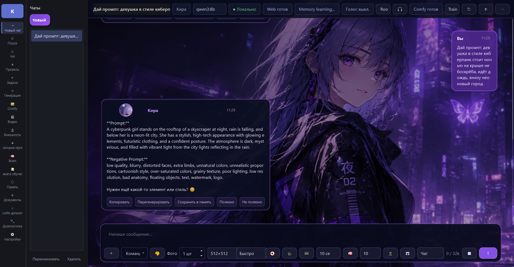
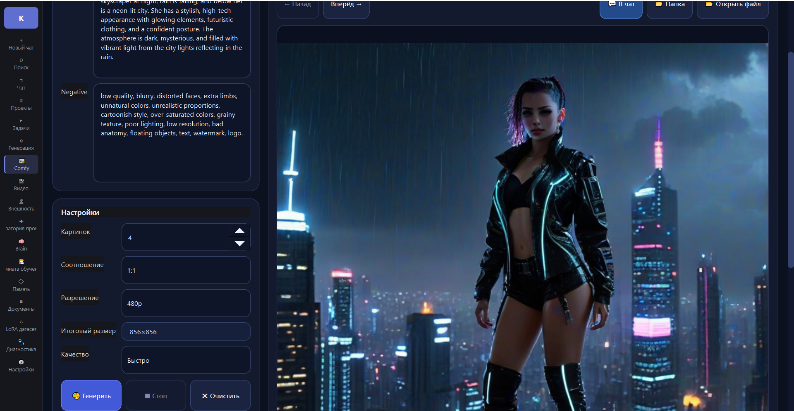
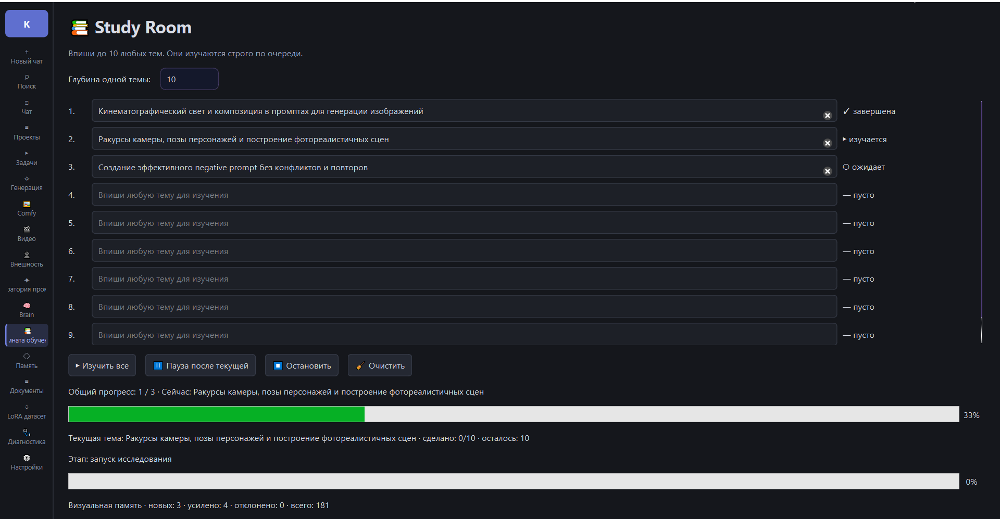
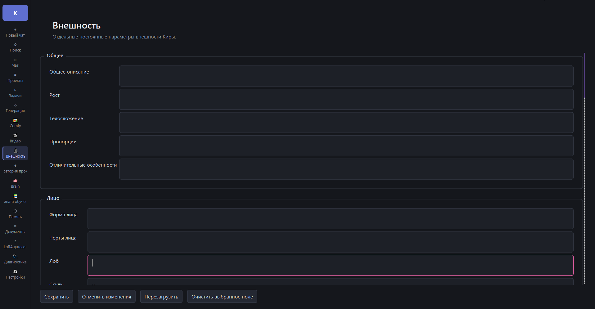

# Kira AI Studio

**English** | [Русский](README_RU.md)

**A local AI workspace for Windows with Ollama, persistent memory, ComfyUI integration, prompt tools, research, image generation, and video workflows.**

Kira AI Studio combines a local AI assistant, structured prompt creation, image and video generation, research tools, documents, memory, and training workflows in one desktop application.

> **Early Access**
>
> The public demo download link will be added soon.

---

## Key Features

- Local AI chat powered by Ollama
- Persistent long-term memory and conversation history
- Projects and structured tasks
- Positive and negative prompt creation
- Prompt Lab and Prompt Brain
- Local image generation through ComfyUI
- Local image-to-video workflows
- Automatic VRAM release after generation
- Study Room research workflow
- Documents and local RAG
- Internet-assisted research
- Persistent character appearance canon
- LoRA dataset preparation tools
- Voice mode
- English and Russian interface support
- Local storage for user chats, memory, and generated content

---

## Prompt Creation and Local Generation

  
  

Kira can transform a short idea into a structured image prompt, generate both positive and negative prompts, and send the result into a selected local ComfyUI workflow.

Generation settings include image count, aspect ratio, resolution, quality presets, workflow selection, previews, and result management.

After generation, Kira can release occupied VRAM so local language models and generation workflows can share limited GPU resources more efficiently.

---

## Study Room and Prompt Knowledge

  
  

Study Room researches selected topics in sequence. It can collect sources, analyze the material, prepare a technical report, and save reusable prompt-writing knowledge locally.

Prompt Brain stores structured technical knowledge for future relevant requests.

The Appearance page stores a persistent visual canon. Hair, eyes, face, body type, proportions, and distinctive features can be defined once and reused when Kira creates new character prompts.

---

## Local-First Workflow

Kira AI Studio is designed to run on the user's own computer:

- Local language models run through Ollama
- Image and video generation runs through local ComfyUI workflows
- Chats, memory, projects, and generated content remain on the local machine
- No cloud subscription is required for the main local features
- Internet access is only required for web research and external services selected by the user

Your actual hardware requirements depend on the selected Ollama models, checkpoints, LoRAs, and ComfyUI workflows.

---

## Demo

### English Product Demo

**YouTube link:** Coming soon

### Demo Download

**Windows demo download:** Coming soon

The demo version will provide a limited introduction to Kira's local chat and generation workflow.

---

## System Requirements

- Windows 10 or Windows 11
- Ollama installed and configured
- ComfyUI installed and configured
- A GPU compatible with the selected models and workflows
- Sufficient storage for local models, checkpoints, workflows, and generated files
- VRAM requirements depend on the selected models and generation settings

Kira has been developed and tested with limited VRAM workflows, but performance depends on the user's hardware and configuration.

---

## Project Status

Kira AI Studio is currently in **Early Access**.

The complete project is offered as a working application with the full source code for the buyer.

**The source code is not published in this public repository.**

This repository is used for product information, screenshots, demonstrations, updates, and future demo downloads.

---

## Questions and Future Videos

The current demo shows only part of the application.

Questions about installation, Ollama, ComfyUI, VRAM usage, Study Room, memory, prompt creation, image generation, video workflows, or other features are welcome.

Future videos will cover additional Kira features and other local AI tools and indie projects developed by ZeroVRAM.

---

## Contact

For purchase inquiries, demonstrations, and technical questions:

- Telegram: [@eikzcBVmCMT](https://t.me/eikzcBVmCMT)
- Email: [sasha100635@gmail.com](mailto:sasha100635@gmail.com)
- YouTube: [ZeroVRAM](https://www.youtube.com/@ZeroVRAM)

---

**ZeroVRAM**

Local AI • Creative Tools • Indie Games

Build • Create • Experiment

© 2026 Kira AI Studio
